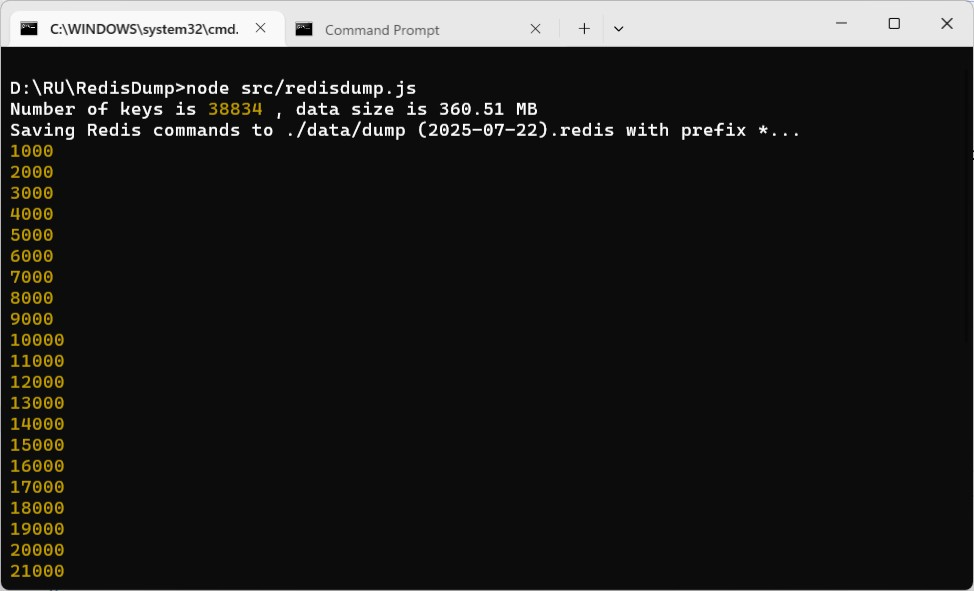
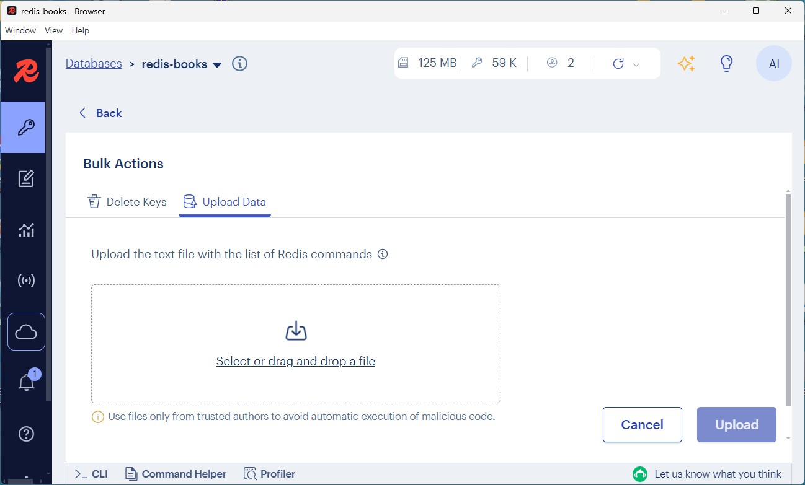

### RedisDump － The last piece of puzzle

> An utility to dump [String](https://redis.io/docs/latest/develop/data-types/strings/), [List](https://redis.io/docs/latest/develop/data-types/lists/), [Set](https://redis.io/docs/latest/develop/data-types/sets/), [Sorted Set](https://redis.io/docs/latest/develop/data-types/sorted-sets/), [Hash](https://redis.io/docs/latest/develop/data-types/hashes/) and [Json](https://redis.io/docs/latest/develop/data-types/json/) six main data structures from Redis database.

I was thinking there exists a utility akin to [mysqldump](https://dev.mysql.com/doc/refman/8.4/en/mysqldump.html) in [MariaDB](https://mariadb.org/) for Redis, which helps me backup data from my [Redis Cloud](https://redis.io/cloud/) account as well as instances running on local machine. 

Redis Cloud *does* provide remote backup functionalities:


Which makes me sweat, the only usable option is to setup a FTP Server with public ip. In addition, the backup is done on 24 hours interval.  

So... I ask HIM to build `redisdump.js`: 


```
node src/redisdump.js DONGDICT:*

node src/redisdump.js DIRINDEX:*

node src/redisdump.js 
```



To dump data out of Redis Cloud is a *slow* process, better not to do it in peak hour, it is a backup after all. You can always push `dump (yyyy-mm-dd).redis` back into Redis via the Bulk Action in [Redis Insight](https://redis.io/insight/). 



`redisdump.js` 
```
/*
   redisdump.js 
*/
import { redis } from './redis/redis.js'
import { createWriteStream } from 'fs';
import { format } from 'date-fns';
import { info } from './help.js'
import { luaCountKey } from './countKeys.js'

async function dumpRedis(prefix, scanCount, outputFile) {
  const output = createWriteStream(outputFile, { flags: 'w' });
  let counter = 0; 
  let cursor = '0';
  let keys = []

  console.log(`Saving Redis commands to ${outputFile} with prefix ${prefix}...`);    
  try {
    do {
      const result = await redis.scan(cursor, {
        MATCH: prefix,
        COUNT: scanCount, 
      });

      cursor = result.cursor;
      keys = result.keys;

      for (const key of keys) {
        const type = await redis.type(key);

        switch (type) {
          case 'string': {
            const val = await redis.get(key);
            output.write(`SET "${key}" "${val}"\n`);
            break;
          }
          case 'list': {
            const items = await redis.lRange(key, 0, -1);
            items.forEach(item => {
              output.write(`RPUSH "${key}" "${item}"\n`);
            });
            break;
          }
          case 'set': {
            const members = await redis.sMembers(key);
            if (members.length)
              output.write(`SADD "${key}" ${members.map(m => `"${m}"`).join(' ')}\n`);
            break;
          }
          case 'zset': {
            const zitems = await redis.zRangeWithScores(key, 0, -1);
            zitems.forEach(({ value, score }) => {
              output.write(`ZADD "${key}" ${score} "${value}"\n`);
            });
            break;
          }
          case 'hash': {
            const fields = await redis.hGetAll(key);
            const flat = Object.entries(fields).map(([k, v]) => `"${k}" "${v}"`).join(' ');
            output.write(`HSET "${key}" ${flat}\n`);
            break;
          }
          case 'ReJSON-RL': {
            const json = await redis.sendCommand(['JSON.GET', key]);
            output.write(`JSON.SET "${key}" "." '${json}'\n`);
            break;
          }
          default:
            output.write(`# Skipped ${key}: unsupported type "${type}"\n`);
        }
        counter = counter + 1 
        if ((counter / scanCount) === Math.floor(counter / scanCount) ) {
          console.log(counter)
        }
      }
    } while (cursor !== '0');
  } catch (err) {
    throw err;
  } finally {
    console.log(counter)
    output.end();
  }
}

async function countKeys(prefix) {
  return await redis.eval(luaCountKey, {
    keys: prefix
  });
}

/*
   main 
*/
const args = process.argv.slice(2); 
const prefix = args[0] || '*';  // default '*'
const scanCount = 1000          // adjust batch size as needed

const dateSuffix = format(new Date(), 'yyyy-MM-dd');
const outputFile = `./data/dump (${dateSuffix}).redis`;

if (args.includes('--help')) {
  console.log(info);
} else {
  await redis.connect()
  const [keys, size] = await countKeys(prefix)
  console.log('Number of keys is', keys, 
              ', data size is', Number(size / 1024 / 1024).toFixed(2), 'MB')
  await dumpRedis(prefix, scanCount, outputFile);
  await redis.close()
}

process.exit(0)
```


### EOF (2025/07/25)
