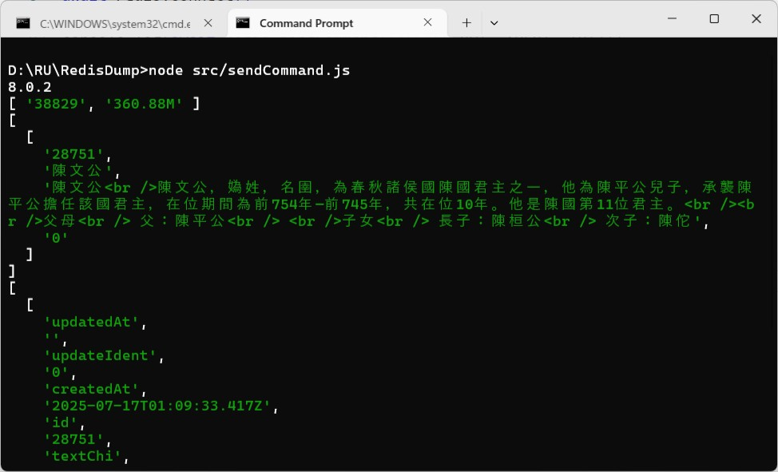
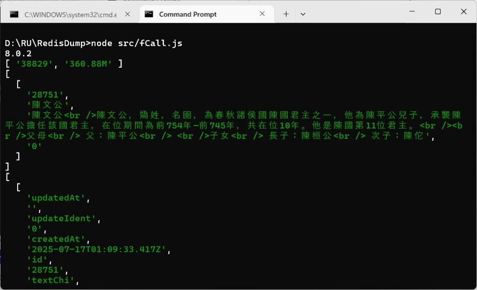

### [Scripting with Lua](https://redis.io/docs/latest/develop/programmability/eval-intro/)
> "And it is not a case of habit, feelings do not become blunted by dint of habit when it’s a simple matter of judgement; one just has to abandon one’s misconceptions."<br />The Castle by Franz Kafka


#### Prologue 
```
Forget what we won't,
Accept what we don't,
Challenge what we daren't. 

Inward dread and anguish overcomes, 
but not flesh and blood,  
This is the end,
all the same beginning of things. 
```


#### I. [Redis programmability](https://redis.io/docs/latest/develop/programmability/) (TL;DR)
> Extending Redis with Lua and Redis Functions

> Redis provides a programming interface that lets you execute custom scripts on the server itself. In Redis 7 and beyond, you can use [Redis Functions](https://redis.io/docs/latest/develop/programmability/functions-intro/) to manage and run your scripts. In Redis 6.2 and below, you use [Lua scripting with the EVAL command](https://redis.io/docs/latest/develop/programmability/eval-intro/) to program the server.

##### **Background** 

> Redis is, by [definition](https://github.com/redis/redis/blob/unstable/MANIFESTO#L7), a *"domain-specific language for abstract data types"*. The language that Redis speaks consists of its [commands](https://redis.io/docs/latest/commands/). Most the commands specialize at manipulating core [data types](https://redis.io/docs/latest/develop/data-types/) in different ways. In many cases, these commands provide all the functionality that a developer requires for managing application data in Redis.

> The term **programmability** in Redis means having the ability to execute arbitrary user-defined logic by the server. We refer to such pieces of logic as **scripts**. In our case, scripts enable processing the data where it lives, a.k.a *data locality*. Furthermore, the responsible embedding of programmatic workflows in the Redis server can help in reducing network traffic and improving overall performance. Developers can use this capability for implementing robust, application-specific APIs. Such APIs can encapsulate business logic and maintain a data model across multiple keys and different data structures.

> User scripts are executed in Redis by an embedded, sandboxed scripting engine. Presently, Redis supports a single scripting engine, the [Lua 5.1](https://www.lua.org/) interpreter.

> Please refer to the [Redis Lua API Reference](https://redis.io/docs/latest/develop/programmability/lua-api/) page for complete documentation.

##### **Running scripts**

> Redis provides two means for running scripts.

> Firstly, and ever since Redis 2.6.0, the [EVAL](https://redis.io/docs/latest/commands/eval/) command enables running server-side scripts. Eval scripts provide a quick and straightforward way to have Redis run your scripts ad-hoc. However, using them means that the scripted logic is a part of your application (not an extension of the Redis server). Every applicative instance that runs a script must have the script's source code readily available for loading at any time. That is because scripts are only cached by the server and are volatile. As your application grows, this approach can become harder to develop and maintain.

> Secondly, added in v7.0, Redis Functions are essentially scripts that are first-class database elements. As such, functions decouple scripting from application logic and enable independent development, testing, and deployment of scripts. To use functions, they need to be loaded first, and then they are available for use by all connected clients. In this case, loading a function to the database becomes an administrative deployment task (such as loading a Redis module, for example), which separates the script from the application.

> Please refer to the following pages for more information:

- [Redis Eval Scripts](https://redis.io/docs/latest/develop/programmability/eval-intro/)
- [Redis Functions](https://redis.io/docs/latest/develop/programmability/functions-intro/)

> When running a script or a function, Redis guarantees its atomic execution. The script's execution blocks all server activities during its entire time, similarly to the semantics of [transactions](https://redis.io/docs/latest/develop/using-commands/transactions/). These semantics mean that all of the script's effects either have yet to happen or had already happened. The blocking semantics of an executed script apply to all connected clients at all times.

> Note that the potential downside of this blocking approach is that executing slow scripts is not a good idea. It is not hard to create fast scripts because scripting's overhead is very low. However, if you intend to use a slow script in your application, be aware that all other clients are blocked and can't execute any command while it is running.

##### **Read-only scripts**

> A read-only script is a script that only executes commands that don't modify any keys within Redis. Read-only scripts can be executed either by adding the no-writes [flag](https://redis.io/docs/latest/develop/programmability/lua-api/#script_flags) to the script or by executing the script with one of the read-only script command variants: [EVAL_RO](https://redis.io/docs/latest/commands/eval_ro/), [EVALSHA_RO](https://redis.io/docs/latest/commands/evalsha_ro/), or [FCALL_RO](https://redis.io/docs/latest/commands/fcall_ro/). They have the following properties:

- They can always be executed on replicas.
- They can always be killed by the [SCRIPT KILL](https://redis.io/docs/latest/commands/script-kill/) command.
- They never fail with OOM error when redis is over the memory limit.
- They are not blocked during write pauses, such as those that occur during coordinated failovers.
- They cannot execute any command that may modify the data set.
- Currently [PUBLISH](https://redis.io/docs/latest/commands/publish/), [SPUBLISH](https://redis.io/docs/latest/commands/spublish/) and [PFCOUNT](https://redis.io/docs/latest/commands/pfcount/) are also considered write commands in scripts, because they could attempt to propagate commands to replicas and AOF file.

> In addition to the benefits provided by all read-only scripts, the read-only script commands have the following advantages:

- They can be used to configure an ACL user to only be able to execute read-only scripts.
- Many clients also better support routing the read-only script commands to replicas for applications that want to use replicas for read scaling.

Read-only script history 

> Read-only scripts and read-only script commands were introduced in Redis 7.0

- Before Redis 7.0.1 [PUBLISH](https://redis.io/docs/latest/commands/publish/), [SPUBLISH](https://redis.io/docs/latest/commands/spublish/) and [PFCOUNT](https://redis.io/docs/latest/commands/pfcount/) were not considered write commands in scripts
- Before Redis 7.0.1 the no-writes [flag](https://redis.io/docs/latest/develop/programmability/lua-api/#script_flags) did not imply allow-oom
- Before Redis 7.0.1 the no-writes [flag](https://redis.io/docs/latest/develop/programmability/lua-api/#script_flags) did not permit the script to run during write pauses.

> The recommended approach is to use the standard scripting commands with the no-writes flag unless you need one of the previously mentioned features.

##### **Sandboxed script context** 

> Redis places the engine that executes user scripts inside a sandbox. The sandbox attempts to prevent accidental misuse and reduce potential threats from the server's environment.

> Scripts should never try to access the Redis server's underlying host systems, such as the file system, network, or attempt to perform any other system call other than those supported by the API.

> Scripts should operate solely on data stored in Redis and data provided as arguments to their execution.

##### **Maximum execution time**

> Scripts are subject to a maximum execution time (set by default to five seconds). This default timeout is enormous since a script usually runs in less than a millisecond. The limit is in place to handle accidental infinite loops created during development.

> It is possible to modify the maximum time a script can be executed with millisecond precision, either via redis.conf or by using the [CONFIG SET](https://redis.io/docs/latest/commands/config-set/) command. The configuration parameter affecting max execution time is called busy-reply-threshold.

> When a script reaches the timeout threshold, it isn't terminated by Redis automatically. Doing so would violate the contract between Redis and the scripting engine that ensures that scripts are atomic. Interrupting the execution of a script has the potential of leaving the dataset with half-written changes.

> Therefore, when a script executes longer than the configured timeout, the following happens:

- Redis logs that a script is running for too long.
- It starts accepting commands again from other clients but will reply with a BUSY error to all the clients sending normal commands. The only commands allowed in this state are [SCRIPT KILL](https://redis.io/docs/latest/commands/script-kill/), [FUNCTION KILL](https://redis.io/docs/latest/commands/function-kill/), and SHUTDOWN NOSAVE.
- It is possible to terminate a script that only executes read-only commands using the [SCRIPT KILL](https://redis.io/docs/latest/commands/script-kill/) and [FUNCTION KILL](https://redis.io/docs/latest/commands/function-kill/) commands. These commands do not violate the scripting semantic as no data was written to the dataset by the script yet.
- If the script had already performed even a single write operation, the only command allowed is SHUTDOWN NOSAVE that stops the server without saving the current data set on disk (basically, the server is aborted).

[Redis functions](https://redis.io/docs/latest/develop/programmability/functions-intro/)

Scripting with Redis 7 and beyond

[Scripting with Lua](https://redis.io/docs/latest/develop/programmability/eval-intro/)

Executing Lua in Redis

[Redis Lua API reference](https://redis.io/docs/latest/develop/programmability/lua-api/)

Executing Lua in Redis

[Debugging Lua scripts in Redis](https://redis.io/docs/latest/develop/programmability/lua-debugging/)

How to use the built-in Lua debugger


#### II. [Scripting with Lua](https://redis.io/docs/latest/develop/programmability/eval-intro/) (TL;DR)
> Executing Lua in Redis

> Redis lets users upload and execute Lua scripts on the server. Scripts can employ programmatic control structures and use most of the [commands](https://redis.io/docs/latest/commands/) while executing to access the database. Because scripts execute in the server, reading and writing data from scripts is very efficient.

> Redis guarantees the script's atomic execution. While executing the script, all server activities are blocked during its entire runtime. These semantics mean that all of the script's effects either have yet to happen or had already happened.

> Scripting offers several properties that can be valuable in many cases. These include:

- Providing locality by executing logic where data lives. Data locality reduces overall latency and saves networking resources.
- Blocking semantics that ensure the script's atomic execution.
- Enabling the composition of simple capabilities that are either missing from Redis or are too niche to be a part of it.

> Lua lets you run part of your application logic inside Redis. Such scripts can perform conditional updates across multiple keys, possibly combining several different data types atomically.

> Scripts are executed in Redis by an embedded execution engine. Presently, Redis supports a single scripting engine, the [Lua 5.1](https://www.lua.org/) interpreter. Please refer to the [Redis Lua API Reference](https://redis.io/docs/latest/develop/programmability/lua-api/) page for complete documentation.

> Although the server executes them, Eval scripts are regarded as a part of the client-side application, which is why they're not named, versioned, or persisted. So all scripts may need to be reloaded by the application at any time if missing (after a server restart, fail-over to a replica, etc.). As of version 7.0, [Redis Functions](https://redis.io/docs/latest/develop/programmability/functions-intro/) offer an alternative approach to programmability which allow the server itself to be extended with additional programmed logic.

##### **Getting started**

> We'll start scripting with Redis by using the [EVAL](https://redis.io/docs/latest/commands/eval/) command.

> Here's our first example:

```
> EVAL "return 'Hello, scripting!'" 0
"Hello, scripting!"
```

> In this example, [EVAL](https://redis.io/docs/latest/commands/eval/) takes two arguments. The first argument is a string that consists of the script's Lua source code. The script doesn't need to include any definitions of Lua function. It is just a Lua program that will run in the Redis engine's context.

> The second argument is the number of arguments that follow the script's body, starting from the third argument, representing Redis key names. In this example, we used the value 0 because we didn't provide the script with any arguments, whether the names of keys or not.

##### **Script parameterization**

It is possible, although highly ill-advised, to have the application dynamically generate script source code per its needs. For example, the application could send these two entirely different, but at the same time perfectly identical scripts:

```
redis> EVAL "return 'Hello'" 0
"Hello"
redis> EVAL "return 'Scripting!'" 0
"Scripting!"
```

> Although this mode of operation isn't blocked by Redis, it is an anti-pattern due to script cache considerations (more on the topic below). Instead of having your application generate subtle variations of the same scripts, you can parametrize them and pass any arguments needed for to execute them.

> The following example demonstrates how to achieve the same effects as above, but via parameterization:

```
redis> EVAL "return ARGV[1]" 0 Hello
"Hello"
redis> EVAL "return ARGV[1]" 0 Parameterization!
"Parameterization!"
```

> At this point, it is essential to understand the distinction Redis makes between input arguments that are names of keys and those that aren't.

> While key names in Redis are just strings, unlike any other string values, these represent keys in the database. The name of a key is a fundamental concept in Redis and is the basis for operating the Redis Cluster.

> **Important**: to ensure the correct execution of scripts, both in standalone and clustered deployments, all names of keys that a script accesses must be explicitly provided as input key arguments. The script **should only** access keys whose names are given as input arguments. Scripts **should never** access keys with programmatically-generated names or based on the contents of data structures stored in the database.

> Any input to the function that isn't the name of a key is a regular input argument.

> In the example above, both *Hello* and *Parameterization*! regular input arguments for the script. Because the script doesn't touch any keys, we use the numerical argument *0* to specify there are no key name arguments. The execution context makes arguments available to the script through [KEYS](https://redis.io/docs/latest/develop/programmability/lua-api/#the-keys-global-variable) and [ARGV](https://redis.io/docs/latest/develop/programmability/lua-api/#the-argv-global-variable) global runtime variables. The *KEYS* table is pre-populated with all key name arguments provided to the script before its execution, whereas the *ARGV* table serves a similar purpose but for regular arguments.

> The following attempts to demonstrate the distribution of input arguments between the scripts *KEYS* and *ARGV* runtime global variables:

```
redis> EVAL "return { KEYS[1], KEYS[2], ARGV[1], ARGV[2], ARGV[3] }" 2 key1 key2 arg1 arg2 arg3
1) "key1"
2) "key2"
3) "arg1"
4) "arg2"
5) "arg3"
```

**Note**: as can been seen above, Lua's table arrays are returned as [RESP2 array replies](https://redis.io/docs/latest/develop/reference/protocol-spec/#resp-arrays), so it is likely that your client's library will convert it to the native array data type in your programming language. Please refer to the rules that govern [data type conversion](https://redis.io/docs/latest/develop/programmability/lua-api/#data-type-conversion) for more pertinent information.

##### **Interacting with Redis from a script**

> It is possible to call Redis commands from a Lua script either via [redis.call()](https://redis.io/docs/latest/develop/programmability/lua-api/#redis.call) or [redis.pcall()](https://redis.io/docs/latest/develop/programmability/lua-api/#redis.pcall).

> The two are nearly identical. Both execute a Redis command along with its provided arguments, if these represent a well-formed command. However, the difference between the two functions lies in the manner in which runtime errors (such as syntax errors, for example) are handled. Errors raised from calling redis.call() function are returned directly to the client that had executed it. Conversely, errors encountered when calling the redis.pcall() function are returned to the script's execution context instead for possible handling.

> For example, consider the following:

```
> EVAL "return redis.call('SET', KEYS[1], ARGV[1])" 1 foo bar
OK
```

The above script accepts one key name and one value as its input arguments. When executed, the script calls the [SET](https://redis.io/docs/latest/commands/set/) command to set the input key, *foo*, with the string value "bar".

##### **Script cache**

> Until this point, we've used the [EVAL](https://redis.io/docs/latest/commands/eval/) command to run our script.

> Whenever we call [EVAL](https://redis.io/docs/latest/commands/eval/), we also include the script's source code with the request. Repeatedly calling [EVAL](https://redis.io/docs/latest/commands/eval/) to execute the same set of parameterized scripts, wastes both network bandwidth and also has some overheads in Redis. Naturally, saving on network and compute resources is key, so, instead, Redis provides a caching mechanism for scripts.

> Every script you execute with [EVAL](https://redis.io/docs/latest/commands/eval/) is stored in a dedicated cache that the server keeps. The cache's contents are organized by the scripts' SHA1 digest sums, so the SHA1 digest sum of a script uniquely identifies it in the cache. You can verify this behavior by running [EVAL](https://redis.io/docs/latest/commands/eval/) and calling [INFO](https://redis.io/docs/latest/commands/info/) afterward. You'll notice that the *used_memory_scripts_eval* and *number_of_cached_scripts* metrics grow with every new script that's executed.

> As mentioned above, dynamically-generated scripts are an [anti-pattern](https://en.wikipedia.org/wiki/Anti-pattern). Generating scripts during the application's runtime may, and probably will, exhaust the host's memory resources for caching them. Instead, scripts should be as generic as possible and provide customized execution via their arguments.

> A script is loaded to the server's cache by calling the [SCRIPT LOAD](https://redis.io/docs/latest/commands/script-load/) command and providing its source code. The server doesn't execute the script, but instead just compiles and loads it to the server's cache. Once loaded, you can execute the cached script with the SHA1 digest returned from the server.

> Here's an example of loading and then executing a cached script:

```
redis> SCRIPT LOAD "return 'Immabe a cached script'"
"c664a3bf70bd1d45c4284ffebb65a6f2299bfc9f"
redis> EVALSHA c664a3bf70bd1d45c4284ffebb65a6f2299bfc9f 0
"Immabe a cached script"
```

##### **Cache volatility**

> The Redis script cache is **always volatile**. It isn't considered as a part of the database and is **not persisted**. The cache may be cleared when the server restarts, during fail-over when a replica assumes the master role, or explicitly by [SCRIPT FLUSH](https://redis.io/docs/latest/commands/script-flush/). That means that cached scripts are ephemeral, and the cache's contents can be lost at any time.

> Applications that use scripts should always call [EVALSHA](https://redis.io/docs/latest/commands/evalsha/) to execute them. The server returns an error if the script's SHA1 digest is not in the cache. For example:

```
redis> EVALSHA ffffffffffffffffffffffffffffffffffffffff 0
(error) NOSCRIPT No matching script
```

> In this case, the application should first load it with [SCRIPT LOAD](https://redis.io/docs/latest/commands/script-load/) and then call [EVALSHA](https://redis.io/docs/latest/commands/evalsha/) once more to run the cached script by its SHA1 sum. Most of Redis' clients already provide utility APIs for doing that automatically. Please consult your client's documentation regarding the specific details.

**EVALSHA in the context of pipelining**

> Special care should be given executing [EVALSHA](https://redis.io/docs/latest/commands/evalsha/) in the context of a [pipelined request](https://redis.io/docs/latest/develop/using-commands/pipelining/). The commands in a pipelined request run in the order they are sent, but other clients' commands may be interleaved for execution between these. Because of that, the NOSCRIPT error can return from a pipelined request but can't be handled.

> Therefore, a client library's implementation should revert to using plain [EVAL](https://redis.io/docs/latest/commands/eval/) of parameterized in the context of a pipeline.

**Script cache semantics** 

> During normal operation, an application's scripts are meant to stay indefinitely in the cache (that is, until the server is restarted or the cache being flushed). The underlying reasoning is that the script cache contents of a well-written application are unlikely to grow continuously. Even large applications that use hundreds of cached scripts shouldn't be an issue in terms of cache memory usage.

> The only way to flush the script cache is by explicitly calling the [SCRIPT FLUSH](https://redis.io/docs/latest/commands/script-flush/) command. Running the command will *completely flush* the scripts cache, removing all the scripts executed so far. Typically, this is only needed when the instance is going to be instantiated for another customer or application in a cloud environment.

> Also, as already mentioned, restarting a Redis instance flushes the non-persistent script cache. However, from the point of view of the Redis client, there are only two ways to make sure that a Redis instance was not restarted between two different commands:

- The connection we have with the server is persistent and was never closed so far.
- The client explicitly checks the run_id field in the [INFO](https://redis.io/docs/latest/commands/info/) command to ensure the server was not restarted and is still the same process.

> Practically speaking, it is much simpler for the client to assume that in the context of a given connection, cached scripts are guaranteed to be there unless the administrator explicitly invoked the [SCRIPT FLUSH](https://redis.io/docs/latest/commands/script-flush/) command. The fact that the user can count on Redis to retain cached scripts is semantically helpful in the context of pipelining.

##### **The SCRIPT command**

> The Redis [SCRIPT](https://redis.io/docs/latest/commands/script/) provides several ways for controlling the scripting subsystem. These are:

- [SCRIPT FLUSH](https://redis.io/docs/latest/commands/script-flush/): this command is the only way to force Redis to flush the scripts cache. It is most useful in environments where the same Redis instance is reassigned to different uses. It is also helpful for testing client libraries' implementations of the scripting feature.

- [SCRIPT EXISTS](https://redis.io/docs/latest/commands/script-exists/): given one or more SHA1 digests as arguments, this command returns an array of 1's and 0's. 1 means the specific SHA1 is recognized as a script already present in the scripting cache. 0's meaning is that a script with this SHA1 wasn't loaded before (or at least never since the latest call to [SCRIPT FLUSH](https://redis.io/docs/latest/commands/script-flush/)).

- SCRIPT LOAD script: this command registers the specified script in the Redis script cache. It is a useful command in all the contexts where we want to ensure that [EVALSHA](https://redis.io/docs/latest/commands/evalsha/) doesn't not fail (for instance, in a pipeline or when called from a [MULTI](https://redis.io/docs/latest/commands/multi/)/[EXEC](https://redis.io/docs/latest/commands/exec/) [transaction](https://redis.io/docs/latest/develop/using-commands/transactions/), without the need to execute the script.

- [SCRIPT KILL](https://redis.io/docs/latest/commands/script-kill/): this command is the only way to interrupt a long-running script (a.k.a slow script), short of shutting down the server. A script is deemed as slow once its execution's duration exceeds the configured [maximum execution time](https://redis.io/docs/latest/develop/programmability/#maximum-execution-time) threshold. The [SCRIPT KILL](https://redis.io/docs/latest/commands/script-kill/) command can be used only with scripts that did not modify the dataset during their execution (since stopping a read-only script does not violate the scripting engine's guaranteed atomicity).

- [SCRIPT DEBUG](https://redis.io/docs/latest/commands/script-debug/): controls use of the built-in [Redis Lua scripts debugger](https://redis.io/docs/latest/develop/programmability/lua-debugging/).


##### **Script replication**

> In standalone deployments, a single Redis instance called *master* manages the entire database. A [clustered deployment](https://redis.io/docs/latest/operate/oss_and_stack/management/scaling/) has at least three masters managing the sharded database. Redis uses [replication](https://redis.io/docs/latest/operate/oss_and_stack/management/replication/) to maintain one or more replicas, or exact copies, for any given master.

> Because scripts can modify the data, Redis ensures all write operations performed by a script are also sent to replicas to maintain consistency. There are two conceptual approaches when it comes to script replication:

1. Verbatim replication: the master sends the script's source code to the replicas. Replicas then execute the script and apply the write effects. This mode can save on replication bandwidth in cases where short scripts generate many commands (for example, a *for* loop). However, this replication mode means that replicas redo the same work done by the master, which is wasteful. More importantly, it also requires [all write scripts to be deterministic](https://redis.io/docs/latest/develop/programmability/eval-intro/#scripts-with-deterministic-writes).

2. Effects replication: only the script's data-modifying commands are replicated. Replicas then run the commands without executing any scripts. While potentially lengthier in terms of network traffic, this replication mode is deterministic by definition and therefore doesn't require special consideration.

> Verbatim script replication was the only mode supported until Redis 3.2, in which effects replication was added. The *lua-replicate-commands* configuration directive and [redis.replicate_commands()](https://redis.io/docs/latest/develop/programmability/lua-api/#redis.replicate_commands) Lua API can be used to enable it.

> In Redis 5.0, effects replication became the default mode. As of Redis 7.0, verbatim replication is no longer supported.

**Replicating commands instead of scripts**

> **Note**: Starting with Redis 5.0, script replication is by default effect-based rather than verbatim. In Redis 7.0, verbatim script replication had been removed entirely. The following section only applies to versions lower than Redis 7.0 when not using effect-based script replication.

> An important part of scripting is writing scripts that only change the database in a deterministic way. Scripts executed in a Redis instance are, by default until version 5.0, propagated to replicas and to the AOF file by sending the script itself -- not the resulting commands. Since the script will be re-run on the remote host (or when reloading the AOF file), its changes to the database must be reproducible.

> The reason for sending the script is that it is often much faster than sending the multiple commands that the script generates. If the client is sending many scripts to the master, converting the scripts into individual commands for the replica / AOF would result in too much bandwidth for the replication link or the Append Only File (and also too much CPU since dispatching a command received via the network is a lot more work for Redis compared to dispatching a command invoked by Lua scripts).

> Normally replicating scripts instead of the effects of the scripts makes sense, however not in all the cases. So starting with Redis 3.2, the scripting engine is able to, alternatively, replicate the sequence of write commands resulting from the script execution, instead of replication the script itself.

> In this section, we'll assume that scripts are replicated verbatim by sending the whole script. Let's call this replication mode **verbatim scripts replication**.

> The main drawback with the *whole scripts replication* approach is that scripts are required to have the following property: the script **always must** execute the same Redis *write* commands with the same arguments given the same input data set. Operations performed by the script can't depend on any hidden (non-explicit) information or state that may change as the script execution proceeds or between different executions of the script. Nor can it depend on any external input from I/O devices.

> Acts such as using the system time, calling Redis commands that return random values (e.g., [RANDOMKEY](https://redis.io/docs/latest/commands/randomkey/)), or using Lua's random number generator, could result in scripts that will not evaluate consistently.

> To enforce the deterministic behavior of scripts, Redis does the following:

- Lua does not export commands to access the system time or other external states.
- Redis will block the script with an error if a script calls a Redis command able to alter the data set **after** a Redis random command like [RANDOMKEY](https://redis.io/docs/latest/commands/randomkey/), [SRANDMEMBER](https://redis.io/docs/latest/commands/srandmember/), [TIME](https://redis.io/docs/latest/commands/time/). That means that read-only scripts that don't modify the dataset can call those commands. Note that a *random command* does not necessarily mean a command that uses random numbers: any non-deterministic command is considered as a random command (the best example in this regard is the [TIME](https://redis.io/docs/latest/commands/time/) command).
- In Redis version 4.0, commands that may return elements in random order, such as [SMEMBERS](https://redis.io/docs/latest/commands/smembers/) (because Redis Sets are *unordered*), exhibit a different behavior when called from Lua, and undergo a silent lexicographical sorting filter before returning data to Lua scripts. So `redis.call("SMEMBERS",KEYS[1])` will always return the Set elements in the same order, while the same command invoked by normal clients may return different results even if the key contains exactly the same elements. However, starting with Redis 5.0, this ordering is no longer performed because replicating effects circumvents this type of non-determinism. In general, even when developing for Redis 4.0, never assume that certain commands in Lua will be ordered, but instead rely on the documentation of the original command you call to see the properties it provides.
- Lua's pseudo-random number generation function `math.random` is modified and always uses the same seed for every execution. This means that calling [math.random](https://redis.io/docs/latest/develop/programmability/lua-api/#runtime-libraries) will always generate the same sequence of numbers every time a script is executed (unless `math.randomseed` is used).

> All that said, you can still use commands that write and random behavior with a simple trick. Imagine that you want to write a Redis script that will populate a list with N random integers.

> The initial implementation in Ruby could look like this:

```
require 'rubygems'
require 'redis'

r = Redis.new

RandomPushScript = <<EOF
    local i = tonumber(ARGV[1])
    local res
    while (i > 0) do
        res = redis.call('LPUSH',KEYS[1],math.random())
        i = i-1
    end
    return res
EOF

r.del(:mylist)
puts r.eval(RandomPushScript,[:mylist],[10,rand(2**32)])
```

> Every time this code runs, the resulting list will have exactly the following elements:

```
redis> LRANGE mylist 0 -1
 1) "0.74509509873814"
 2) "0.87390407681181"
 3) "0.36876626981831"
 4) "0.6921941534114"
 5) "0.7857992587545"
 6) "0.57730350670279"
 7) "0.87046522734243"
 8) "0.09637165539729"
 9) "0.74990198051087"
10) "0.17082803611217"
```

> To make the script both deterministic and still have it produce different random elements, we can add an extra argument to the script that's the seed to Lua's pseudo-random number generator. The new script is as follows:

```
RandomPushScript = <<EOF
    local i = tonumber(ARGV[1])
    local res
    math.randomseed(tonumber(ARGV[2]))
    while (i > 0) do
        res = redis.call('LPUSH',KEYS[1],math.random())
        i = i-1
    end
    return res
EOF

r.del(:mylist)
puts r.eval(RandomPushScript,1,:mylist,10,rand(2**32))
```

> What we are doing here is sending the seed of the PRNG as one of the arguments. The script output will always be the same given the same arguments (our requirement) but we are changing one of the arguments at every invocation, generating the random seed client-side. The seed will be propagated as one of the arguments both in the replication link and in the Append Only File, guaranteeing that the same changes will be generated when the AOF is reloaded or when the replica processes the script.

> Note: an important part of this behavior is that the PRNG that Redis implements as math.random and math.randomseed is guaranteed to have the same output regardless of the architecture of the system running Redis. 32-bit, 64-bit, big-endian and little-endian systems will all produce the same output.

##### **Debugging Eval scripts**

> When memory usage in Redis exceeds the maxmemory limit, the first write command encountered in the script that uses additional memory will cause the script to abort (unless [redis.pcall](https://redis.io/docs/latest/develop/programmability/lua-api/#redis.pcall) was used).

> However, an exception to the above is when the script's first write command does not use additional memory, as is the case with (for example, [DEL](https://redis.io/docs/latest/commands/del/) and [LREM](https://redis.io/docs/latest/commands/lrem/)). In this case, Redis will allow all commands in the script to run to ensure atomicity. If subsequent writes in the script consume additional memory, Redis' memory usage can exceed the threshold set by the maxmemory configuration directive.

> Another scenario in which a script can cause memory usage to cross the maxmemory threshold is when the execution begins when Redis is slightly below maxmemory, so the script's first write command is allowed. As the script executes, subsequent write commands consume more memory leading to the server using more RAM than the configured maxmemory directive.

> In those scenarios, you should consider setting the maxmemory-policy configuration directive to any values other than `noeviction`. In addition, Lua scripts should be as fast as possible so that eviction can kick in between executions.

> Note that you can change this behaviour by using flags

#### **Eval flags**

> Normally, when you run an Eval script, the server does not know how it accesses the database. By default, Redis assumes that all scripts read and write data. However, starting with Redis 7.0, there's a way to declare flags when creating a script in order to tell Redis how it should behave.

> The way to do that is by using a Shebang statement on the first line of the script like so:

```
#!lua flags=no-writes,allow-stale
local x = redis.call('get','x')
return x
```

> Note that as soon as Redis sees the #! comment, it'll treat the script as if it declares flags, even if no flags are defined, it still has a different set of defaults compared to a script without a #! line.

> Another difference is that scripts without #! can run commands that access keys belonging to different cluster hash slots, but ones with #! inherit the default flags, so they cannot.

> Please refer to [Script flags](https://redis.io/docs/latest/develop/programmability/lua-api/#script_flags) to learn about the various scripts and the defaults.

---


#### III. A Quick Start Guide 
For those who don't want to crawl through official documentations: 

- [Redis programmability](https://redis.io/docs/latest/develop/programmability/) outlines the whole landscape of Redis programming ecology. 
- [Scripting with Lua](https://redis.io/docs/latest/develop/programmability/eval-intro/) describes Lua Scripting in Redis in general.
- [Redis functions](https://redis.io/docs/latest/develop/programmability/functions-intro/) describes the new Redis Functions features. 

Redis Functions are functions written in Lua. The syntax for function definition is: 
```
	function ::= function funcbody
	funcbody ::= `(´ [parlist] `)´ block end
```

The following syntactic sugar simplifies function definitions:
```
	stat ::= function funcname funcbody
	stat ::= local function Name funcbody
	funcname ::= Name {`.´ Name} [`:´ Name]
```

They are loaded into Redis and survive a server reboot and therefore provide better way to share code among Redis clients. Redis Functions can be invoked via [FCALL](https://redis.io/docs/latest/commands/fcall/) or [FCALL_RO](https://redis.io/docs/latest/commands/fcall_ro/) depending on whether the functions perform read/write or read only operations. The use of [FCALL_RO](https://redis.io/docs/latest/commands/fcall_ro/) offers subtle advantages and you *should* always stick to it whenever possible. If you are already familiar Lua Script, converting existing scripts into Redis Functions is only a couple of steps. 

Code template for Redis function: 
```
#!lua name=mylib

local function myfunc(KEYS, ARGV)
  <place your lua script here>
end

redis.register_function('myfunc', myfunc )
```

Code template for Redis function with **no-writes** [flag](https://redis.io/docs/latest/develop/programmability/lua-api/#script_flags):
```
#!lua name=mylib

local function myfunc(KEYS, ARGV)
  <place your lua script here>
end

redis.register_function{
  function_name = 'myfunc',
  callback = myfunc,
  flags = { 'no-writes' }
} 
```

The first line states that we are using Lua as scripting engine and name of the library. I *deliberately* opt `KEYS` for keys arguments and `ARGV` for regular arguments to comply the naming convention in Lua Script. Functions of read/write and read only bear different syntax. You can create a file mixed with read write and read only functions. All functions of a library have to loaded in one go. 

`loader.js`
```
import { redis } from './redis/redis.js'
import { readFile } from 'fs/promises';

/*
   main 
*/
await redis.connect();

// Load Lua function from file
const luaScript = await readFile('./src/myLib.lua', 'utf8');
console.log(await redis.sendCommand(['FUNCTION', 'LOAD', 'REPLACE', luaScript]), 'loaded');

await redis.close();
process.exit(0)
```

Run command to load Redis Functions with: 
```
node src/loader.js
mylib loaded
```

And check with: 
```
> FUNCTION LIST LIBRARYNAME mylib
1) 1) "library_name"
   2) "mylib"
   3) "engine"
   4) "LUA"
   5) "functions"
   6) 1) 1) "name"
         2) "countKeys"
         3) "description"
         4) "null"
         5) "flags"
         6) 1) "no-writes"
      2) 1) "name"
         2) "delall"
         3) "description"
         4) "null"
         5) "flags"
         6) (empty list or set)
      3) 1) "name"
         2) "zAddIncr"
         3) "description"
         4) "null"
         5) "flags"
         6) (empty list or set)
      4) 1) "name"
         2) "ver"
         3) "description"
         4) "null"
         5) "flags"
         6) 1) "no-writes"
      5) 1) "name"
         2) "scanTextChi"
         3) "description"
         4) "null"
         5) "flags"
         6) 1) "no-writes"
      6) 1) "name"
         2) "libs"
         3) "description"
         4) "null"
         5) "flags"
         6) 1) "no-writes"
      7) 1) "name"
         2) "toFix"
         3) "description"
         4) "null"
         5) "flags"
         6) 1) "no-writes"
      8) 1) "name"
         2) "zSumScore"
         3) "description"
         4) "null"
         5) "flags"
         6) 1) "no-writes"
```

Done!


#### IV. Example usage
##### **Really trivial things**
To get the Redis Version: 
```
> FCALL_RO VER 0
"8.0.2"
```

To round up a number to a number of decimal place: 
```
> FCALL_RO TOFIX 2 123.456 2
"123.46"

> FCALL_RO TOFIX 1 123.456
"123.46"
```

##### **Utility functions**
Sometimes it is necessary to check number of keys of a pattern and it's size: 
```
> FCALL_RO COUNTKEYS 1 DONGDICT:*
1) "28792"
2) "32.73M"

> FCALL_RO COUNTKEYS 1 DIRINDEX:*
1) "31009"
2) "25.07M"
```

Sometimes it is necessary to remove keys of a pattern: 
```
> FCALL DELALL 1 temp:*
3

> FCALL DELALL 1 cache:*
12
```

You can do something like: 
```
DELETE FROM users; 
```

##### **Extension to underlaying Data Structures**
Set, being the best candidate for data deduplication, sometimes it is convenient to keep the their number of  occurrence also. Every time a member is added to Sorted Set, it's score is increased by one: 
```
> FCALL ZADDINCR 1 testz a b c d e f 
(integer) 6

> FCALL ZADDINCR 1 testz a b c d e
(integer) 5

> FCALL ZADDINCR 1 testz a b c d
(integer) 4

> FCALL ZADDINCR 1 testz a b c
(integer) 3

> FCALL ZADDINCR 1 testz a b
(integer) 2

> FCALL ZADDINCR 1 testz a
(integer) 1

> FCALL_RO ZSUMSCORE 1 testz
(integer) 21
```

With `ZADDINCR` and `ZSUMSCORE`, it is possible to keep track of **Cardinality**, **Membership** and **Frequency** in a single3 Sorted Set. 
```
> ZCARD testz
(integer) 6

> ZSCORE testz a
"6"

> ZSCORE testz g
(nil)

> ZRANGE testz 0 -1 REV WITHSCORES
1) "a"
2) "6"
3) "b"
4) "5"
5) "c"
6) "4"
7) "d"
8) "3"
9) "e"
10) "2"
11) "f"
12) "1"
```

##### **Proof of concept**
Sometimes it is handy to find out Hash with field containing some text, like so using SQL: 
```
SELECT id, textChi, visited 
FROM documents 
WHERE textChi LIKE '%鄭文公%'
limit 10 OFFSET 0;
```

`scanTextChi` is practically doing a `SCAN` key and test of condition, it is an inefficient way of searching... 
```
> FCALL_RO SCANTEXTCHI 5 fts:chinese:documents:* key 鄭文公 0 10 id textChi visited
1) 1) "11199"
   2) "\xe9\x84\xad\xe6\x96\x87\xe5\x85\xac<br / ..."
   3) "0"
```
```   
> FCALL_RO SCANTEXTCHI 3 fts:chinese:documents:* key 鄭文公
1) 1) "updatedAt"
   2) ""
   3) "updateIdent"
   4) "0"
   5) "createdAt"
   6) "2025-07-17T00:36:15.301Z"
   7) "id"
   8) "11199"
   9) "textChi"
   10) "\xe9\x84\xad\xe6\x96\x87\xe5\x85\xac<br / ..."
   11) "visited"
   12) "0"
   13) "key"
   14) "\xe9\x84\xad\xe6\x96\x87\xe5\x85\xac"
```

##### **Raw interface**
Call with `sendCommand`: 
```
console.log(await redis.sendCommand(['FCALL_RO', 'VER', '0']))
console.log(await redis.sendCommand(['FCALL_RO', 'COUNTKEYS', '0']))
console.log(await redis.sendCommand(['FCALL_RO', 'SCANTEXTCHI', '3', 
    'fts:chinese:documents:*', 'key', '陳文公', 
    'id', 'key', 'textChi', 'visited']))
console.log(await redis.sendCommand(['FCALL_RO', 'SCANTEXTCHI', '3', 
    'fts:chinese:documents:*', 'key', '陳文公'])) 
```



##### **The Wrapper**
To wrap up with: 
```
redis.fCall = function(name, keys = [], args = []) {
    const numkeys = keys.length.toString();
    return this.sendCommand(['FCALL', name, numkeys, ...keys, ...args]);
  };

redis.fCallRo = function(name, keys = [], args = []) {
    const numkeys = keys.length.toString();
    return this.sendCommand(['FCALL_RO', name, numkeys, ...keys, ...args]);
  };
```

And call it intuitively: 
```
console.log(await redis.fCallRo('ver', [], []))
console.log(await redis.fCallRo('countKeys', [], []))
console.log(await redis.fCallRo('scanTextChi', 
    ['fts:chinese:documents:*', 'key', '陳文公'], 
    ['id', 'key', 'textChi', 'visited']))
console.log(await redis.fCallRo('scanTextChi', 
    ['fts:chinese:documents:*', 'key', '陳文公']))
```




#### V. Bibliography
1. [Redis programmability](https://redis.io/docs/latest/develop/programmability/)
2. [Scripting with Lua](https://redis.io/docs/latest/develop/programmability/eval-intro/)
3. [Redis Lua API reference](https://redis.io/docs/latest/develop/programmability/lua-api/)
4. [Redis functions](https://redis.io/docs/latest/develop/programmability/functions-intro/)
5. [Lua 5.1 Reference Manual](https://www.lua.org/manual/5.1/)
6. [Debugging Lua scripts in Redis](https://redis.io/docs/latest/develop/programmability/lua-debugging/)
7. [The Castle by Franz Kafka](https://files.libcom.org/files/Franz%20Kafka-The%20Castle%20(Oxford%20World's%20Classics)%20(2009).pdf)


#### VI. Appendix
**Script command summary**
```
SCRIPT <subcommand> [<arg> [value] [opt] ...]. Subcommands are:

    DEBUG (YES|SYNC|NO)
        Set the debug mode for subsequent scripts executed.
    EXISTS <sha1> [<sha1> ...]
        Return information about the existence of the scripts in the script cache.
    FLUSH [ASYNC|SYNC]
        Flush the Lua scripts cache. Very dangerous on replicas.
        When called without the optional mode argument, the behavior is determined by the
        lazyfree-lazy-user-flush configuration directive. Valid modes are:
    ASYNC: Asynchronously flush the scripts cache.
    SYNC: Synchronously flush the scripts cache.
    KILL
        Kill the currently executing Lua script.
    LOAD <script>
        Load a script into the scripts cache without executing it.
    HELP
        Print this help.
```

**Function command summary**
```
FUNCTION <subcommand> [<arg> [value] [opt] ...]. Subcommands are:

    LOAD [REPLACE] <FUNCTION CODE>
        Create a new library with the given library name and code.
    DELETE <LIBRARY NAME>
        Delete the given library.
    LIST [LIBRARYNAME PATTERN] [WITHCODE]
        Return general information on all the libraries:
        Library name
        The engine used to run the Library
        Library description
        Functions list
        * Library code (if WITHCODE is given)
        It also possible to get only function that matches a pattern using LIBRARYNAME argument.
    STATS
        Return information about the current function running:
        Function name
        Command used to run the function
        Duration in MS that the function is running
        If no function is running, return nil
        In addition, returns a list of available engines.
    KILL
        Kill the current running function.
    FLUSH [ASYNC|SYNC]
        Delete all the libraries.
        When called without the optional mode argument, the behavior is determined by the
        lazyfree-lazy-user-flush configuration directive. Valid modes are:
        * ASYNC: Asynchronously flush the libraries.
        * SYNC: Synchronously flush the libraries.
    DUMP
        Return a serialized payload representing the current libraries, can be restored using FUNCTION RESTORE command
    RESTORE <PAYLOAD> [FLUSH|APPEND|REPLACE]
        Restore the libraries represented by the given payload, it is possible to give a restore policy to
        control how to handle existing libraries (default APPEND):
        * FLUSH: delete all existing libraries.
        * APPEND: appends the restored libraries to the existing libraries. On collision, abort.
        * REPLACE: appends the restored libraries to the existing libraries, On collision, replace the old
        libraries with the new libraries (notice that even on this option there is a chance of failure"
        in case of functions name collision with another library).
    HELP
        Print this help.
```


#### Epilogue 


### EOF (2025/08/01)